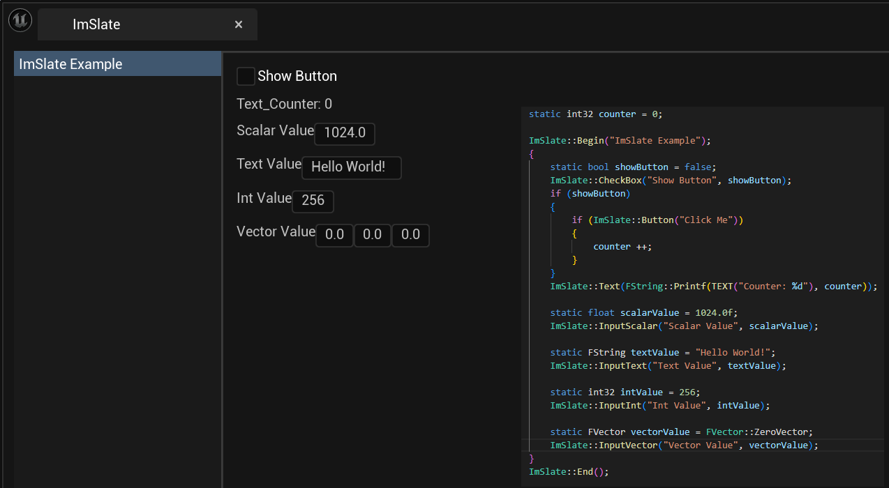
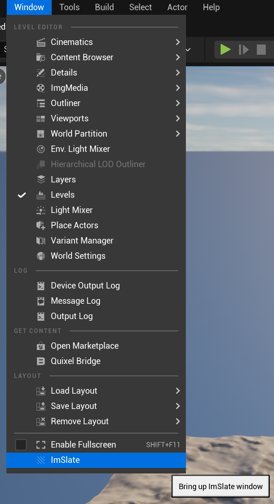
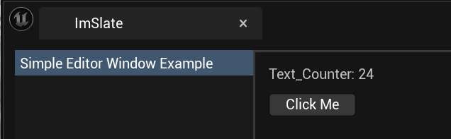
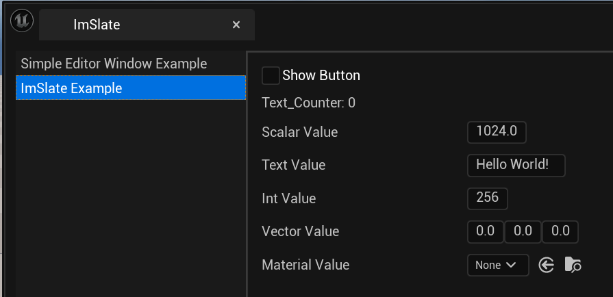

# ImSlate

**This is not a part of Dear ImGUI library**



Do you have the following problems:

- You just want to quickly make a prototype or test some features, but you want a GUI.

- You want to use Dear ImGui in the Unreal Engine, and then you met the input focus problem like you cannot control the camera when you are interacting with the ImGui widgets

- Your programmer want to write an editor plugin with a window and some widgets, but he or she doesn't want to learn the grammar of Slate.

So this is a plugin for you: create Slate-based window in runtime or in editor, with your familiar ImGui-style APIs.

# Notes

- The target of this plugin is **easy-to-use** instead of performance. If you need the window to be faster, please use Slate directly.
- This plugin is actually a proof-of-concept project. I cannot support all the ImGui APIs, only a subset.

# Quick Start

Copy ImSlate folder in Plugins to your project's Plugins folder, and enable this plugin.

Then, just add this code to any cpp file.

```cpp
#include "ImSlateRuntime.h"
#include "ImSlateSimpleEditorWindow.h"

static FImSlateSimpleEditorWindow ExampleWindow(
    []()
    {
        static int32 counter = 0;
        ImSlate::Begin("Simple Editor Window Example");
        {
            ImSlate::Text(FString::Printf(TEXT("Counter: %d"), counter));
            if (ImSlate::Button("Click Me"))
            {
                counter ++;
            }
        }
        ImSlate::End();
    }
);
```
Start the engine, open Window -> ImSlate


And you will see your window.



# Use ImSlate in Game Mode

Put this code into your GameMode's Tick function will create a ImSlate window for you

```cpp
ImSlate::Begin("ImSlate Example");
    {
        static bool showButton = false;
        ImSlate::CheckBox("Show Button", showButton);
        if (showButton)
        {
            if (ImSlate::Button("Click Me"))
            {
                counter ++;        
            }
        }
        ImSlate::Text(FString::Printf(TEXT("Counter: %d"), counter));

        static float scalarValue = 1024.0f;
        ImSlate::InputScalar("Scalar Value", scalarValue);

        static FString textValue = "Hello World!";
        ImSlate::InputText("Text Value", textValue);

        static int32 intValue = 256;
        ImSlate::InputInt("Int Value", intValue);

        static FVector vectorValue = FVector::ZeroVector;
        ImSlate::InputVector("Vector Value", vectorValue);

        static UObject* materialValue = nullptr;
        ImSlate::InputAsset("Material Value", materialValue, UMaterial::StaticClass());
    }
    ImSlate::End();
```



You can also use this in your actor classes, but remember, if you have multiple classes sharing the same window (with the same name), you will only get one (the last) window.

A solution is add a suffix to each window, based on your actor's name.

# References

https://github.com/ocornut/imgui